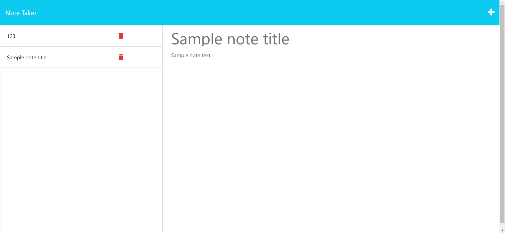

# Note Taker app
  
  ## Description
  This Note Taker application is a tool that allow users to easily organize their thoughts by recording information and notes to keep track of their tasks.
  The developer was required to build on the back end codes, given the starter code containing HTML, CSS and Javascript was already created.
  Below is a screenshot of the sample webpage that has been dynamically generated based on the user inputs:

  ## Table of Contents
  - [Description](#description)
  - [Usage](#usage)
  - [Contributing](#contributing)
  - [Questions](#questions)
  ## Usage
  To use the application, simply click on the button "Get Started" on the main page to enter the application. Click on Note Title to give each note a title, then type in the corresponding details you wish to record. Once the note is completed, hit the Save icon on the top right corner of the page. This will save the input and display the note title on the left hand side as a list. You can add more notes by clicking on the + icon on the top right corner. To retrieve the contents of the note, click on the note title displayed on the left hand side list, the contents of the notes will then display in the main middle section of the page. Delete the notes by clicking on the bin icon of the corresponding note you wish to remove.
  

  ## Contributing
  If you would like to contribute to this project, head to my GitHub page to see details of the application code. You can also contact me via my email below for any suggestions and feedback.
  
  ## Questions
  Check out my projects on my GitHub account at https://github.com/Sandy5433
  . If you have any questions about the application, you can reach me via my email at sandyhung83@yahoo.com.tw 
  